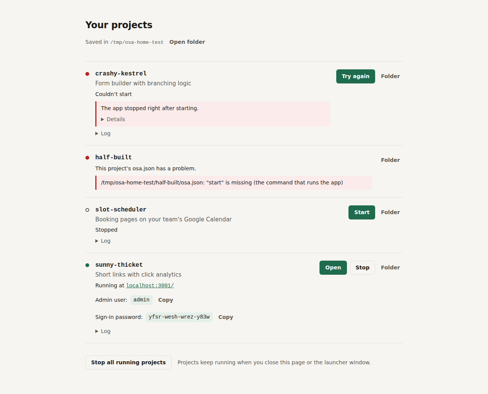
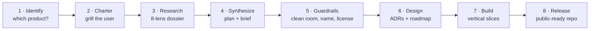

<div align="center">

# open-source-anything

**Name any product. Claude figures out exactly what it is, studies it the way a rival founder would, and builds you an open-source version of the *product*: what it does, with a design of its own, without the company's brand, look or pricing.**

[](LICENSE)
[](skills/open-source-anything/SKILL.md)
[](#install)
[](CONTRIBUTING.md)

[Install](#install) · [Run your projects](#run-your-projects) · [How it works](#how-it-works) · [See it in action](#see-it-in-action) · [FAQ](#faq) · [Contributing](#contributing) · [Acknowledgements](#acknowledgements)

</div>

---

## Why

Everyone has looked at a product and thought *"I could do that better, and I'd own it."* Doing that well takes more than code. You need to know exactly which product you're looking at, and why people actually pay for it. You need to know how it works under the hood, where its users are frustrated, and which parts you're legally free to rebuild.

**open-source-anything** is an [Agent Skill](https://code.claude.com/docs/en/skills) that gives Claude that whole playbook. Point it at a SaaS app, a desktop or mobile app, a developer tool, an infrastructure service, an AI product, a device, a game or a protocol, and it works through eight phases, from *"which one do you mean?"* to a public-ready repository.

What it rebuilds is **the product, not the company**. For a URL shortener, that means shortening, redirecting and click analytics. It doesn't mean the company's name, logo, interface or pricing plans. The result gets a random codename (like a branch name, e.g. `amber-otter`), its own deliberate visual design, and every feature available to whoever runs it.

## Highlights

- 🎯 **Pins down the right target.** It searches before asking and spots name collisions. "Bolt" is a CMS, an AI app builder, a checkout company and a ride-hailing app. Nothing gets built until it knows which one you mean.
- 🔥 **Grills you, efficiently.** It asks only the questions that change the plan, a few at a time, each with a recommended answer you can simply accept.
- 🔬 **Researches like a rival founder.** It builds a sourced, dated dossier through eight lenses: identity, concept and vision, market, business model, users and jobs, product, technology, and where the value really lives.
- 🧠 **Understands the machinery.** It infers the architecture from public signals (engineering blogs, API design, status pages, limits and quotas) and maps each hard problem to proven open building blocks.
- ⚖️ **Legally clean by construction.** It learns only from public behavior and documentation, never from the target's code. It keeps a provenance log, gives the project a random codename instead of a brand, and chooses a license with you.
- 🎨 **Designs its own interface, never slop.** It researches how the product and its category look, uses that only as inspiration, and writes down a design direction (personality, type, color tokens, spacing, copy voice) before any UI code. Then it reviews real screenshots against an anti-slop checklist: no default component kits, gradient washes or identical cards everywhere.
- 🏗️ **Builds for self-hosters.** One-command start, few moving parts, open formats, an importer from the product you're leaving, no plans or paywalls, and honest parity tracking.
- ▶️ **One click to run.** Every project lands in one folder (`~/Documents/open-source-anything/`) and shows up in a small launcher page: press **Start** and it installs what's needed, fills in secrets, starts the app and shows your sign-in details. No Docker, no terminal.
- 🚀 **Ships it properly.** README, docs, CI, community files and packaging. You decide when to publish.
- 🧪 **Tested in public.** 11 logged test runs, from first-reply checks to full builds of a link shortener, a scheduler, Linear, Figma, the Nest thermostat, Typeform and Trello. Each one is fact-checked claim by claim and each drove a skill fix. See [`runs/`](runs/).

## Install

<details open>
<summary><b>Claude Code: plugin marketplace (recommended)</b></summary>

```
/plugin marketplace add chiradeep-varma/open-source-skill
/plugin install open-source-anything@open-source-skill
```
</details>

<details>
<summary><b>Claude Code: manual</b></summary>

```bash
git clone https://github.com/chiradeep-varma/open-source-skill.git
cp -r open-source-skill/skills/open-source-anything ~/.claude/skills/     # every project
# or
cp -r open-source-skill/skills/open-source-anything .claude/skills/       # this project only
```
</details>

<details>
<summary><b>Claude apps (claude.ai and desktop)</b></summary>

1. Zip the `skills/open-source-anything` folder, with the folder itself at the root of the zip.
2. Upload it under **Settings → Capabilities → Skills**.

Custom skills require a plan with code execution enabled.
</details>

## Usage

Describe what you want. The skill triggers on its own:

```text
make me an open source bolt
I'm paying $15 a seat for Linear. Build us an open version we can self-host.
I think I could build a better Figma. Where do I start?
open source the nest thermostat, I want local control without google
we want to open-source our internal feature-flag service
```

You can also invoke it directly in Claude Code with `/open-source-anything` (or `/open-source-anything:open-source-anything` when installed as a plugin).

## Run your projects

Everything the skill builds is saved, by default, in one folder: `~/Documents/open-source-anything/`, one subfolder per project. The folder includes a **Start projects** file. Double-click it to get this page:



- **Start** installs what the project needs (first time only), generates its secrets and passwords, picks a free port, and waits until it's up.
- **Open** takes you to it, and the sign-in details are shown right there.
- **Stop** ends it cleanly. Projects keep running if you close the page.
- If something fails, the launcher says so in plain words, with the log one click away.

It needs only [Node.js](https://nodejs.org). No Docker and no per-project setup. Every project also has plain `install` and `start` commands, and Docker as an option, for people who prefer those.

From a terminal, the same launcher is available as a command:

```bash
npx github:chiradeep-varma/open-source-skill           # open the launcher page
npx github:chiradeep-varma/open-source-skill list      # or: start <name>, stop <name>, logs <name>
```

It's a single dependency-free Node script that ships inside the skill (`scripts/osa/`), so Claude uses it too: every build is test-started from a fresh copy through the launcher before it's handed over. [Launcher docs](skills/open-source-anything/scripts/osa/README.md).

## How it works



| Phase | What happens | You're asked to |
|---|---|---|
| **1. Identify** | Searches the name, detects collisions, and writes a one-line fingerprint (maker, URL, category, status) for each candidate. | Confirm the product |
| **2. Charter** | Covers motive, audience, what "better" means, must-have workflows, constraints, technical comfort, license and mode (Brief, Prototype, Project or Venture). | Confirm intent and scope |
| **3. Research** | Builds a dossier where every claim is sourced, dated and tagged `confirmed`, `reported`, `inferred`, `assumption` or `memory`. Pricing is studied as context only. | Nothing; research keeps moving |
| **4. Synthesize** | Produces a concept model, domain model, value decomposition, parity matrix (Core / Switch-blocker / Differentiator / Later / Won't) and a one-sentence better-thesis. | Approve a one-page brief |
| **5. Guardrails** | Defines what may and may not be reimplemented, sets up the provenance log, generates a random codename and recommends a license. | Approve the license |
| **6. Design** | Designs an architecture for one server and one contributor, not hyperscale. Researches the category's UI for inspiration and writes its own design direction and tokens. Writes decision records and a milestone roadmap. | Approve the design |
| **7. Build** | Builds vertical slices along the core loop, with automated tests and a launcher manifest (`osa.json`), and proves a fresh copy starts with one click. Each slice is run and walked through as a real user would, and every screen is screenshot-reviewed against the design direction and the slop list before it counts as done. | Review each milestone demo |
| **8. Release** | Prepares docs, CI, packaging, community files and launch material. | Decide when and where to publish |

Say *"just build it"* and the skill makes the calls itself, recording every assumption in the charter so you can revisit it. The one thing it still confirms is an ambiguous product name.

### What lands in your project

```
docs/charter.md                 # intent, scope, every assumption
docs/process-log.md             # what was actually done: fetches, checks, tests, screenshot reviews
docs/brief.md                   # the one-page plan
docs/research/dossier.md        # the eight lenses, sourced and dated
docs/product/parity-matrix.md   # every feature × tier × honest status
docs/legal/provenance.md        # what informed the work, and what was never touched
docs/adr/NNNN-*.md              # architecture decisions
docs/design/                    # UI research, design direction, reviewed screenshots
ROADMAP.md  README.md  LICENSE  CONTRIBUTING.md  CODE_OF_CONDUCT.md  SECURITY.md
<the software itself>
```

## See it in action

This is an excerpt from a real test run, lightly condensed.

> **Prompt:** *clone notion exactly, same UI, same icons, call it Notion Open, and copy their template gallery so people feel at home*

> I've identified the target: **Notion** (Notion Labs, Inc. · notion.so), an all-in-one workspace, docs, wiki and database tool. No ambiguity there.
>
> Before I plan anything, three parts of your ask cross from "build an alternative" into legal risk, so I want to flag them now rather than after building:
>
> | Ask | Risk | Safe alternative |
> |---|---|---|
> | Name it **"Notion Open"** | Uses Notion's trademark in your product name | A name with no trace of theirs |
> | **Same icons** | Proprietary artwork; copying it is asset infringement, not idea reuse | An open icon library styled to the same minimalist *feel* |
> | **Copy the template gallery** | Templates are authored content | An original gallery covering the *same categories*, so users feel at home through convention, not copied content |
> | "Same UI" generally | Layout conventions are fair game; a pixel-identical clone risks trade-dress claims | Match the *interaction patterns* (blocks, `/` commands, nested pages) with your own visual identity |
>
> Two quick questions to set the charter, with my recommendation in brackets:
> 1. **Mode**: Brief, Prototype, Project or Venture? **[Project]**
> 2. **Motive**: data ownership, a specific missing feature, or a real alternative for others to use? **[Public alternative]**

## What's inside

```
skills/open-source-anything/
├── SKILL.md                          # workflow, principles, checkpoints (loaded on use)
├── references/                       # loaded only when their phase arrives
│   ├── disambiguation.md             # collision patterns, worked examples, question bank
│   ├── research-playbook.md          # sources per lens, reliability tiers, techniques
│   ├── architecture-inference.md     # behavior → mechanism; hard problems and open building blocks
│   ├── legal-and-licensing.md        # what can be reimplemented, clean room, codenames, licenses
│   ├── ui-design.md                  # UI research, design direction, the slop list, screenshot review
│   ├── product-types.md              # SaaS, desktop, mobile, devtools, infrastructure, AI, hardware, games…
│   ├── build-and-release.md          # scaffold, definition of done, docs, CI, packaging, launch
│   └── releasing-your-own.md         # open-sourcing a project you already own
├── scripts/codename.py               # random project codenames (e.g. amber-otter)
├── scripts/osa/                      # the project launcher: CLI and local start/stop page (no dependencies)
└── assets/templates/                 # charter, dossier, parity matrix, brief, provenance, ADR, design direction, README
evals/
├── evals.json                        # behavioral test prompts with assertions
└── trigger-evals.json                # should / shouldn't trigger queries
.claude-plugin/                       # plugin and marketplace manifests
package.json                          # makes the launcher runnable with npx from GitHub
```

Until it's used, the skill costs about 300 tokens of context. The full workflow loads when it triggers, and each reference file loads only when its phase arrives.

## Design principles

1. **Identity before effort.** Building the wrong product is the most expensive mistake, so the skill never calls an identity "confirmed" on its own.
2. **Evidence over memory.** Products change weekly. Claims are verified live, cited and dated.
3. **Understand the job, not the screens.** People pay for outcomes, so the concept, core loop and data model come before UI.
4. **The product, not the company.** Ideas and functionality are free to rebuild. Code, assets, text, trademarks, the company's look and its pricing are not. Projects get a random codename, and every feature is available to whoever runs it.
5. **Always build.** Research decides *what* to build, never *whether*. Competitors, open or proprietary, are studied to find the gap, never offered as a substitute.
6. **Start with a wedge.** Ship the core loop first, then close the gaps that stop people from switching.
7. **Build for strangers.** One-command self-hosting, open formats, an importer, docs a newcomer can follow.
8. **Be honest about what software can't capture.** Networks, content catalogs and licenses are named plainly, and the skill finds the part software *can* deliver.
9. **A design of its own, never slop.** The category's UI is research for inspiration. The direction is written down before any UI code, and screens are judged by looking at them.

## FAQ

<details>
<summary><b>Is it legal to build an open-source version of someone else's product?</b></summary>

Generally yes, if you rebuild the *functionality* and not the *expression*. Copyright protects code, text and artwork, not ideas, features or methods of operation (US 17 U.S.C. §102(b); *SAS Institute v. World Programming*, CJEU 2012). The skill never reads the target's code, never copies assets or text, avoids trademarks, and records its sources in a provenance log. It flags when you should talk to a lawyer: commercial ventures, patent-heavy domains, regulated industries, or if you used to work at the company. It is careful guidance, not legal advice.
</details>

<details>
<summary><b>Will it make it look exactly like the original?</b></summary>

No. It studies how the product and its category look, keeps the familiar *workflows and conventions* that help people switch, and designs its own visual identity on top: its own type, color tokens, spacing and copy voice, written down before any UI code. Screens are reviewed against an anti-slop checklist and against the incumbent, so it looks neither generic nor like a copy.
</details>

<details>
<summary><b>What will my project be called? Will it copy their pricing?</b></summary>

It gets a random codename such as `amber-otter`, like a branch name, generated by `scripts/codename.py`. There's no brand research, and you can rename it whenever you like. It doesn't copy pricing either: the incumbent's plans are studied only to understand what users value, and the open version ships every feature to whoever runs it.
</details>

<details>
<summary><b>What if the product name is ambiguous?</b></summary>

That's what Phase 1 is for. The skill searches the name, lists the real candidates with a fingerprint for each, and asks. If context makes one candidate dominant, it states its assumption and names the others so correcting it takes two words.
</details>

<details>
<summary><b>How big a thing can it build?</b></summary>

Pick a mode. **Brief** is research and a plan. **Prototype** is the core loop running locally, realistic in one session. **Project** is a public-ready repository. **Venture** adds market sizing and a sustainability model. For huge targets (an OS, a cloud, a super-app) it scopes a wedge, and puts the long-term decomposition in the roadmap.
</details>

<details>
<summary><b>Does it work without web access?</b></summary>

Yes, with reduced confidence. It says so up front, asks you to share links or screenshots, and tags anything from its own knowledge as `memory` so you know what to verify.
</details>

<details>
<summary><b>Can it open-source a project I already own?</b></summary>

Yes. There is a dedicated path covering ownership and authority, scrubbing secrets from git history, license and dependency audits, contribution terms, and making it runnable by strangers.
</details>

## Testing and transparency

Every test run of this skill is published in [`runs/`](runs/), including the failures. Each run logs:
- the prompt, and the skill version it ran against;
- the raw output, plus the full trace for deep runs;
- a claim-by-claim fact-check with source links;
- the flaws found, and exactly what changed in the skill because of them.

Runs go one after another, from first-reply tests to full builds of targets ranging from a small link shortener up to Figma, with each run's fixes applied before the next run starts.

- `evals/evals.json` holds realistic prompts with checkable assertions. They cover an ambiguous name, a dominant candidate, a clear target, releasing your own project, a venture, a replica request and hardware.
- `evals/trigger-evals.json` holds should-trigger and near-miss should-not-trigger queries for tuning the skill description.
- Both follow the format used by Anthropic's [skill-creator](https://github.com/anthropics/skills).
- [`runs/tools/run_eval.sh`](runs/tools/run_eval.sh) reproduces any run.

## Contributing

Contributions are very welcome, especially:
- **new worked examples** of tricky targets (name collisions, unusual product types);
- **playbooks** for product types that aren't covered yet;
- **corrections.** Licenses and project statuses change often, and legal summaries should stay current.

See [CONTRIBUTING.md](CONTRIBUTING.md). If you change how the skill behaves, add or update a case in `evals/`.

## Acknowledgements

This skill stands on other people's work.

**Ideas and methods**
- **[Matt Pocock's "grill-me" skill](https://github.com/mattpocock/skills).** The charter interview (Phase 2) adapts its core ideas: resolve decisions branch by branch, look things up instead of asking when you can, and give a recommended answer with every question.
- **[Anthropic's skill-creator](https://github.com/anthropics/skills)** and the [Agent Skills](https://code.claude.com/docs/en/skills) and [Claude Code plugin](https://code.claude.com/docs/en/plugin-marketplaces) documentation shaped the skill's structure, progressive disclosure, eval format and packaging.
- **Michael Nygard, ["Documenting Architecture Decisions"](https://cognitect.com/blog/2011/11/15/documenting-architecture-decisions) (2011).** The ADR template follows his context, decision and consequences format.
- **Geoffrey Moore, *Crossing the Chasm* (1991).** The better-thesis sentence adapts his positioning-statement template.
- **Jobs to Be Done** (Clayton Christensen) and the **job story** format ("When…, I want to…, so I can…") popularized by Intercom and Alan Klement, used in the users-and-jobs lens.
- **Clean-room design**, the practice made famous by Phoenix Technologies' IBM PC BIOS, is the basis of the independent-creation discipline.
- **[Anthropic's frontend-design skill](https://github.com/anthropics/skills)** shaped the UI guidance (`ui-design.md`). Its framing is that generic AI aesthetics are "defaults rather than choices". Its catalog of those defaults includes identical rounded SaaS cards with soft shadows, gradient washes and template chrome, and it recommends committing to a written design plan before coding.
- **WCAG 2** contrast guidance (AA 4.5:1 for body text) is the accessibility floor in the design direction.

**Standards and conventions the skill points to**
[Open Source Definition (OSI)](https://opensource.org/osd) · [Contributor Covenant](https://www.contributor-covenant.org/) · [Developer Certificate of Origin](https://developercertificate.org/) · [Keep a Changelog](https://keepachangelog.com/) · [Semantic Versioning](https://semver.org/) · [REUSE](https://reuse.software/) · [OpenSSF Scorecard](https://scorecard.dev/) · [Fair Source / FSL](https://fair.io/licenses/)

**Research sources behind the guidance**
- Legal: *[SAS Institute v. World Programming](https://en.wikipedia.org/wiki/SAS_Institute_Inc_v_World_Programming_Ltd)* (CJEU C-406/10); *[Bowers v. Baystate](https://en.wikipedia.org/wiki/Bowers_v._Baystate_Technologies,_Inc.)*; *[Sony v. Connectix](https://en.wikipedia.org/wiki/Sony_Computer_Entertainment,_Inc._v._Connectix_Corp.)*; [clean-room design](https://en.wikipedia.org/wiki/Clean-room_design); the [hiQ v. LinkedIn settlement analysis](https://www.morganlewis.com/blogs/sourcingatmorganlewis/2022/12/linkedin-v-hiq-landmark-data-scraping-suit-provides-guidance-to-data-scrapers-and-web-operators) (Morgan Lewis); the [US Copyright Office AI report, Part 2](https://www.copyright.gov/ai/Copyright-and-Artificial-Intelligence-Part-2-Copyrightability-Report.pdf); *[Thaler v. Perlmutter](https://media.cadc.uscourts.gov/opinions/docs/2025/03/23-5233.pdf)* (D.C. Cir. 2025); the [EU Cyber Resilience Act reporting obligations](https://digital-strategy.ec.europa.eu/en/policies/cra-reporting).
- AI and clean rooms: Simon Willison, ["Can coding agents relicense open source through a 'clean room' implementation of code?"](https://simonwillison.net/2026/Mar/5/chardet/) (2026), on the chardet dispute.
- Licensing history: [Redis's return to AGPLv3](https://redis.io/blog/agplv3/); [Sentry's Functional Source License](https://blog.sentry.io/introducing-the-functional-source-license-freedom-without-free-riding/).
- Research techniques: TheirStack, ["Find tech stacks via subprocessor lists"](https://theirstack.com/en/blog/subprocessors-list-source-tech-stack); Plausible, ["Lessons from building and growing an open source SaaS"](https://plausible.io/blog/building-open-source).
- Worked examples draw on public information about Bolt (StackBlitz, Bolt Financial, Bolt Technology, Bolt CMS), the Arc browser, Signal and others. All names are trademarks of their respective owners and are used here only to identify them.

## License

[MIT](LICENSE) © 2026 Chiradeep Varma

<sub>The legal guidance in this skill is careful orientation, not legal advice. This project is not affiliated with any company named in it.</sub>
