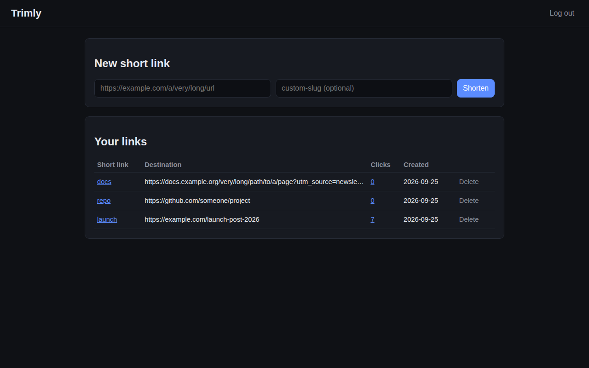
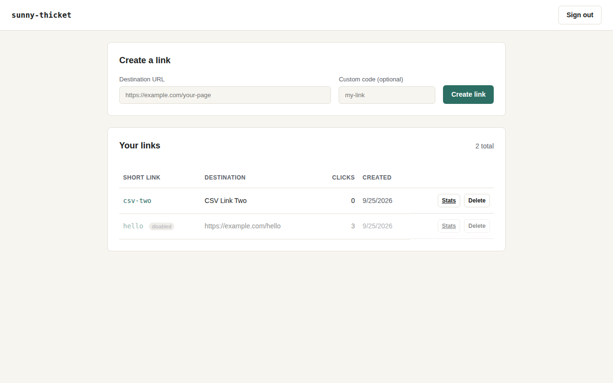
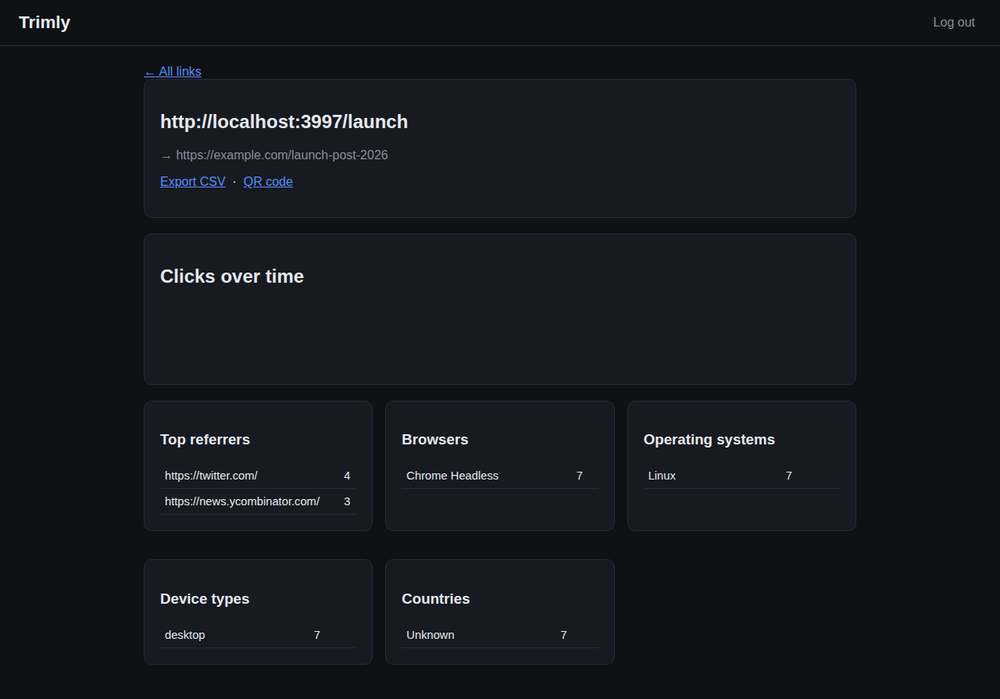
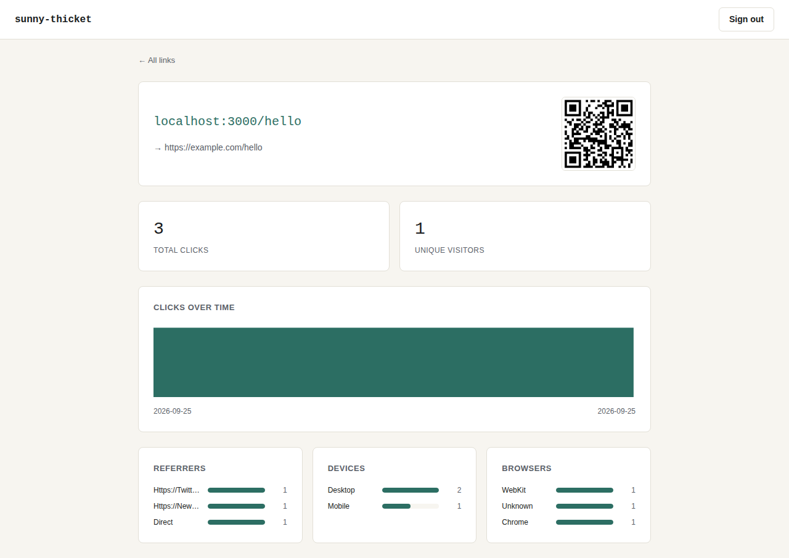

# Run 12: v1.4 check (link shortener again, Prototype mode)

| | |
|---|---|
| Date | 2026-09-25 |
| Type | Deep run: full workflow, headless, via [`../tools/run_eval.sh`](../tools/run_eval.sh). This is **the same prompt as [Run 05](../run-05/)**, so the two can be compared directly. |
| Skill state | v1.4 (commit `7ccfe55`): owner feedback applied (the product, not the company; random codenames; no pricing replication; UI research, a design direction and a screenshot review) |
| Prompt | `I want an open-source Bitly I can self-host for my side projects: short links with click stats. Make the calls yourself and just build it (Prototype mode). Put the project in ./project.` |
| Stats | 11.8 min · 102 turns · 100 tool calls · $3.02 |
| Files | [final reply](final.md) · [trace summary](trace.md) · [full transcript](transcript.jsonl.gz) · [generated project](workspace/project/) · [design direction](workspace/project/docs/design/direction.md) · [its screenshots](workspace/project/docs/design/screenshots/) |

## Outcome in one line

**The v1.4 changes took effect: a random codename (`sunny-thicket`), no tiers, UI research, a written design direction, and a screenshot review that caught a real mobile bug. The UI is clearly more deliberate than Run 05's, but the review was too lenient. It left a card kit, a degenerate chart, a phone-width overflow and mangled URLs. It also offered only a Docker run path, which the owner flagged separately.**

## v1.4 changes: did they take?

| Change | Evidence |
|---|---|
| Random codename, no name research | ✅ `sunny-thicket` |
| No pricing replication | ✅ "Full REST API… no tier gating". The README's pricing-talk check passes. |
| UI research for inspiration only | ✅ `docs/design/ui-research.md`; `ui-design.md` opened (9 skill files in total) |
| Direction before code | ✅ `docs/design/direction.md`: "quiet / precise / durable", warm off-white and near-black, a muted teal accent, monospace for short codes, borders instead of shadows, and an explicit differentiation from the incumbent's orange and from other shorteners' styles |
| Screenshot review | ⚠️ 10 captures (desktop, phone, dark). It caught and fixed a flex-basis bug in the create form, but missed four problems (below). |

## Before and after (same prompt)

| Run 05 (v0.6) | Run 12 (v1.4) |
|---|---|
|  |  |
|  |  |

Run 05's captures were taken by us after the run; its "Clicks over time" chart renders empty. Run 12's captures were taken by the agent itself.

## Design review (by us, after the run)

**Better:**
- a deliberate palette with one restrained accent;
- monospace short codes that are easy to scan;
- labeled inputs;
- a designed "disabled" state;
- right-aligned numbers;
- proportional bars in the breakdowns;
- the QR code in context.

It no longer reads as a default template.

**Still wrong:**

| Issue | Why it matters |
|---|---|
| **Card kit.** Every section, including two stat tiles, sits in an identical bordered white card. | This is the "identical cards everywhere" tell from the slop list. The agent used borders instead of shadows and treated that as avoiding it. |
| **Degenerate chart.** With one day of data, "Clicks over time" renders as one solid teal block. | The chart doesn't handle 0 or 1 data points, and the review didn't vary the data. |
| **Phone overflow.** The links table spills past the card and the viewport; the Stats and Delete buttons sit off-screen. | Visible in its own `dashboard-phone.png`, which was reviewed and passed. |
| **Mangled user data.** Referrers show as "Https://Twitt…": a capitalize transform on URLs, with truncation hiding the domain. | Text transforms were applied to user data, and nobody checked real values. |
| ALL-CAPS section labels ("CLICKS OVER TIME", "REFERRERS") | Borderline template chrome. Defensible for table headers, but it's a default and not a choice. |

## Build verification

| Check | Result |
|---|---|
| `npm test` | ✅ 12/12 (re-run independently) |
| Bitly CSV importer; JSON export | ✅ Present (per its tests and walkthrough) |
| Run instructions | ❌ **Docker only**: `docker compose up -d`, after hand-editing `.env` and generating a secret with `openssl` |

## Flaws found

1. **The screenshot review is too lenient.** A free-form "does it look right?" passes things a skeptical designer wouldn't. The same agent designed it, built it and judged it.
2. **No data variation in the review.** Charts and tables were only seen with friendly data.
3. **No objective layout checks.** A phone-width overflow is mechanically detectable, but nothing checked for it.
4. **Docker-only run path, with manual secret setup** (raised by the owner at the same time).

## Changes made because of this run (v1.5)

- **`ui-design.md` §6: a written review.** For each core screen, `docs/design/review.md` must record:
  - at least three concrete weaknesses found before fixing;
  - an explicit yes/no against every slop tell;
  - the result of a phone-width horizontal-overflow check (`scrollWidth <= innerWidth`);
  - the screen rendered with empty, single-item and realistic many-item or long-value data.
- **`ui-design.md` §4 and §5:**
  - The card-kit tell is about the uniform container, whether it has a shadow or a border.
  - Charts must handle 0, 1 and many points.
  - Never text-transform user data such as URLs, names or codes.
- **Native run path first, Docker optional; the `osa.json` manifest; the project launcher.** See [Run 13](../run-13/).
