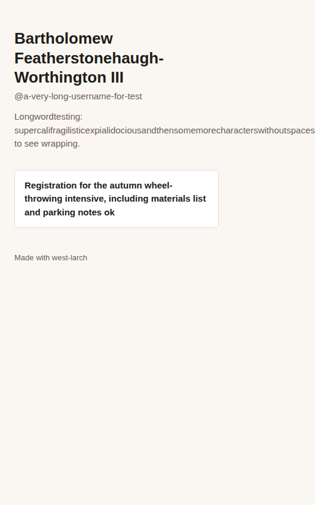

# Run 13: v1.5 check (Linktree-style page, Prototype mode, launcher flow)

| | |
|---|---|
| Date | 2026-09-25 |
| Type | Deep run: full workflow, headless, via [`../tools/run_eval.sh`](../tools/run_eval.sh). `OSA_HOME` pointed at a throwaway folder, so the skill's default projects folder could be tested without touching a real Documents folder. |
| Skill state | v1.5 (commit `7d43131`): the `osa` launcher, the projects folder, `osa.json`, a native run path with no Docker, and the written UI review |
| Prompt | `I'd love my own open-source Linktree that I can run myself. Make the calls yourself and just build it (Prototype mode).` The prompt doesn't say where to build, so choosing a location was the skill's job. |
| Stats | 14.7 min · 134 turns · 132 tool calls · $3.83 |
| Files | [final reply](final.md) · [trace summary](trace.md) · [full transcript](transcript.jsonl.gz) · [the projects folder it created](projects-home/) · [the project](projects-home/west-larch/) · [its process log](projects-home/west-larch/docs/process-log.md) · [our review captures](review/) |

## Outcome in one line

**The launcher flow worked end to end. The skill built in the projects folder, ran `osa setup`, and wrote a valid `osa.json`. A pristine copy started through the folder's own launcher with no manual steps, and the tests pass (19/19).**

**We found six problems:**
- The final reply never mentioned the launcher.
- No written design review.
- LICENSE and CODE_OF_CONDUCT.md typed from memory; both differ from the official texts in substance.
- A phone-width overflow with long input.
- A README claim the code contradicts.
- One wrong funding figure and one misattributed source.

## v1.5 changes: did they take?

| Change | Evidence |
|---|---|
| Build in the projects folder by default | ✅ Built at `<projects folder>/west-larch` and ran `osa setup`, which created `.launcher/`, `start-projects.sh` and `README.txt` ([projects-home/](projects-home/)) |
| `osa.json` | ✅ Valid (`osa check` passes). `SESSION_SECRET` is generated. `reveal` is empty, which is correct: sign-up creates accounts, so there's no admin password to show. |
| Native run path, nothing else to install | ✅ Node, Express and SQLite; `npm install`, then `npm start`. No Docker, no second service. |
| Fresh-copy start through the launcher | ✅ Recorded in the process log. We repeated it with a pristine copy (no `node_modules`, `.env`, data or `.osa/`) and the folder's own launcher: `Installing… Starting… west-larch is running at http://localhost:3001/` in 1.9 s (the npm cache was warm). |
| Passing test command in the log | ✅ 19/19; re-run by us, 19/19 |
| Honest research log | ✅ Every fetch was blocked (`linktr.ee`, the pricing page, `gnu.org`, `contributor-covenant.org`). The log says exactly that, tags every claim `reported`, and doesn't claim the floor was met. |
| Screenshot review | ⚠️ 12 captures at desktop and phone widths. It found and fixed a real overlap in the link editor. But there's **no `docs/design/review.md`**, no long-value data set, and `references/ui-design.md` (where the written review was specified) was never opened. |
| Hand-off | ❌ The final reply gives `npm install && npm start` and says "I can't hand you a live URL". It never mentions the projects folder, **Start projects**, or the launcher. The hand-off lived at the end of Phase 8 ("Release"), which a Prototype that isn't published treated as not applying. |

## Verification (by us, after the run)

| Check | Result |
|---|---|
| `check_artifacts.py` | Every artifact is present except `docs/design/review.md` |
| **LICENSE against the official AGPL-3.0 text** (SPDX) | ❌ **A sentence is missing from section 13**, the network-use clause that is the reason to choose the AGPL: *"This Corresponding Source shall include the Corresponding Source for any work covered by version 3 of the GNU General Public License that is incorporated pursuant to the following paragraph."* It also filled in the "How to Apply" appendix inside `LICENSE`, which is meant to stay as published. |
| **CODE_OF_CONDUCT.md against Contributor Covenant 2.1** | ❌ Six passages differ. It dropped "caste, color" from the pledge, the reporter-privacy obligation ("All community leaders are obligated to respect the privacy and security of the reporter"), and the whole Enforcement Guidelines section (correction, warning, temporary ban, permanent ban). It also rewrote "community leaders" as "project maintainers". It still says "adapted from" the Covenant. |
| Phone width, long data ([script](review/long-data-check.js)) | ❌ The public page is 527px wide on a 390px screen once the bio holds one long unbroken word (the bio allows 280 characters). The dashboard passes.  |
| README claims against the code | ❌ The README says branding removal is "just... included", but the public page has a hardcoded "Made with west-larch" footer and no setting to turn it off. |

## Design review (by us)

**Better than Runs 05 and 12:**
- a restrained warm palette with one accent;
- system fonts, and no gradients, pill buttons or emoji;
- one obvious primary action per screen;
- a designed empty state and 404;
- a public page that is calm and readable at phone width with normal data.

**Still wrong:**
- **Mild card kit.** The dashboard is three identical bordered panels in one column.
- **Cramped link rows.** URL inputs show about 20 characters on desktop despite the free space, so similar links can't be told apart.
- **Awkward wrap.** The "QR code" button wraps onto its own line on desktop.
- **Overflow and footer.** The phone overflow and the footer contradiction above.

## Accuracy (dossier claims, checked by search on 2026-09-25)

| Claim | Verdict | Evidence |
|---|---|---|
| Founded in 2016 in Melbourne by Alex and Anthony Zaccaria and Nick Humphreys | ✅ Correct. The exact day, 23 March, appears only in secondary sources. | [Wikipedia](https://en.wikipedia.org/wiki/Linktree), [TechCrunch](https://techcrunch.com/?p=2782817) |
| Tiers Free, Starter ~$8, Pro ~$15 and Premium ~$35 a month | ✅ Correct, billed monthly (annual billing: $6, $12, $30) | [elev8or](https://www.elev8or.io/blog/bio/linktree-pricing), [Easyapp](https://easyapp.ai/en/blog/linktree-pricing) |
| Seller fees from 12% (Free) down to 0% (Premium) | ✅ Correct (12%, 9%, 9%, 0%) | same |
| "$152M at a $1.7B valuation in 2022" | ❌ Wrong. The March 2022 Series C was **US$110M at a US$1.3B valuation**. A$152M is the same round in Australian dollars, so the dossier mixed currencies. | [TechCrunch](https://techcrunch.com/2022/03/16/linktree-link-in-bio-series-c-valuation/), [Insight Partners](https://www.insightpartners.com/ideas/linktree-raises-110-million-usd-led-by-index-and-coatue-to-power-next-phase-of-growth-for-creators-consumers-and-brands/), [Startup Daily](https://www.startupdaily.net/topic/funding/linktree-clicks-on-152-million-in-series-c/) |
| Source S3, "LinkTree Features" at `thelinktree.com/features`, cited for the feature inventory | ❌ Misattributed. `thelinktree.com` is a separate service that markets itself as a Linktree alternative. Linktree is `linktr.ee`. | [thelinktree.com](https://thelinktree.com/), [linktr.ee](https://linktr.ee/) |

**Score: 3/4 claims correct, plus one misattributed source.** Neither error shaped the build: the funding figure is context, and the features in question are common to the category.

## Flaws found

1. **The hand-off was skipped.** It sat in Phase 8, which the run treated as "release, not applicable" for an unpublished Prototype. The one step that serves non-technical users most was lost.
2. **No written design review.** The requirement lived only in `references/ui-design.md`, and this run never opened that file (Run 12 did). This is the "reference files are opened inconsistently" limitation again: a requirement a run must meet has to be in SKILL.md or a template.
3. **Legal texts from memory.** The run fetched `gnu.org` and `contributor-covenant.org`, was blocked, and fell back to memory. It disclosed that honestly, but both texts came out materially wrong. The skill said "fetch the official text" without giving a way that works when WebFetch is blocked, or a fallback other than memory. A plain HTTPS request to `raw.githubusercontent.com` worked in the same sandbox.
4. **No long-value data in the review.** The overflow check was specified with "realistic" data, and a long unbroken word is what broke the layout.
5. **README claims not checked against the code.**
6. **A lookalike domain treated as the incumbent, and a currency mix-up.**

## Changes made because of this run (v1.6)

- **New `scripts/fetch_text.py`.** It fetches the exact license text by SPDX id, and the Contributor Covenant (3.0 by default, or 2.1), filling in the copyright holder or reporting contact.
  - It tries three sources for licenses: SPDX's data on GitHub, spdx.org, and the `spdx-license-list` npm package.
  - It writes nothing if every source fails. The skill then says to leave a placeholder naming the license and its URL, and to tell the user, never to type the text from memory.
  - SKILL.md Phase 7, `build-and-release.md` and `legal-and-licensing.md` point to it. The process log now records where these texts came from.
- **The written design review is in SKILL.md and has a template.**
  - Phase 7 now spells out the four data sets (empty, one, many, long), the overflow check with long data, and `docs/design/review.md` from the new `assets/templates/design-review.md`.
  - Phase 7 isn't done until that file exists. The template ends with a claims check: each README claim, and where the running app proves it.
- **The hand-off is its own section**, "The hand-off message", with a message shape that leads with the launcher.
  - The workflow says every mode that builds software ends with it.
  - For cloud or remote sessions, it says how to get the project onto the user's computer.
- **README claims must be true of the running app** (Phase 7 quality bar, and the pre-launch checklist).
- **Source identity and currency** added to the evidence standard.
- **`ui-design.md` §6** now names the long data set and `overflow-wrap: anywhere`.
- **Phase 2:** a project the user asks to put outside the projects folder is added to the launcher with `osa add`.
- **`runs/tools/check_artifacts.py`** checks for `docs/design/review.md` and `osa.json`. With `--verify-texts`, it compares LICENSE and CODE_OF_CONDUCT.md with the official texts. On this run it reports the missing §13 sentence and the six changed passages.
