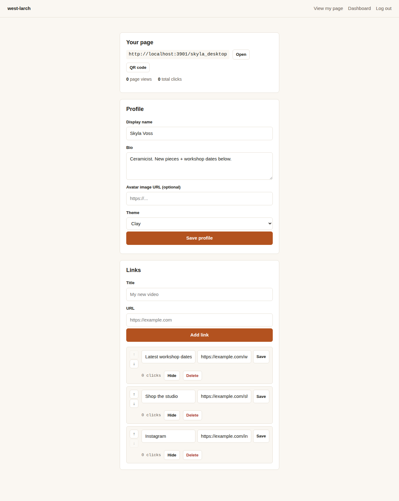

# west-larch

**A self-hosted link-in-bio page builder — one URL you own, with a stack of links, click tracking and no plan gates.**



## Why

Social bios only fit one link. west-larch gives you a single stable page — on your own server, in your own database — that fans out to everything you want people to find: your latest video, your shop, your other socials. Nothing is gated behind a plan: branding removal, analytics, themes and reordering are all just... included. Your page can't disappear because a subscription lapsed, because there's no subscription — it's your server.

## Run it

**With the launcher (easiest).** If this folder is in your projects folder, open that folder, double-click **Start projects**, and press **Start** next to `west-larch`. The launcher installs everything on first start, generates `SESSION_SECRET`, and opens the app.

**By hand, without Docker:** copy `.env.example` to `.env`, fill in `SESSION_SECRET` (the file tells you how to generate one), then:

```bash
npm install
npm start
```

Open http://localhost:3000 and sign up — that becomes your page at `http://localhost:3000/yourusername`.

There is no Docker setup for this project; a single `npm install && npm start` is the whole story. See [docs/self-hosting.md](docs/self-hosting.md) for reverse proxies, custom domains, backups and upgrades.

## Status

west-larch is **alpha** — the core loop works end to end; it hasn't been used in production yet.

| Area | Status |
|---|---|
| Sign up / log in | ✅ |
| Profile (name, bio, avatar, theme) | ✅ |
| Links: add, edit, delete, reorder, hide | ✅ |
| Click tracking + page views | ✅ |
| 5 built-in themes | ✅ |
| QR code for your page | ✅ |
| Per-user custom domains | ⏳ planned ([roadmap](ROADMAP.md)) |
| Scheduled links, video embeds, deeper analytics | ⏳ planned ([roadmap](ROADMAP.md)) |
| Commerce / checkout | 🚫 won't build — see [parity matrix](docs/product/parity-matrix.md) |

Every feature that's built is available to whoever runs it. There are no plans or tiers.

## Features

- **Your own page** at `/yourusername`, with a shareable link and a generated QR code.
- **Links**: add, edit, delete, reorder (up/down), and hide without deleting.
- **Click tracking**: every link counts its own clicks, atomically, plus total page views — no external analytics service.
- **Five flat themes** (Paper, Ink, Moss, Clay, Slate), no gradients, no external font requests.
- **No plan gates**: nothing here is a paid feature.

## Architecture

Node.js + Express + server-rendered EJS + a single SQLite file (via `better-sqlite3`) — one process, one file to back up, no build step. See [docs/architecture.md](docs/architecture.md) for the data model and design choices, and [docs/design/direction.md](docs/design/direction.md) for the visual design direction.

## Importing your data

There's no automated importer yet — see [docs/importing.md](docs/importing.md) for the (quick) manual path.

## Contributing

Contributions are welcome. See [CONTRIBUTING.md](CONTRIBUTING.md).

## Security

Please report vulnerabilities privately. See [SECURITY.md](SECURITY.md).

## License

AGPL-3.0-or-later. See [LICENSE](LICENSE). "west-larch" is a random working codename — rename the project freely if you run your own copy.

<sub>Not affiliated with or endorsed by Linktree. Linktree is a trademark of its owner, mentioned here only to describe the kind of tool this is.</sub>
