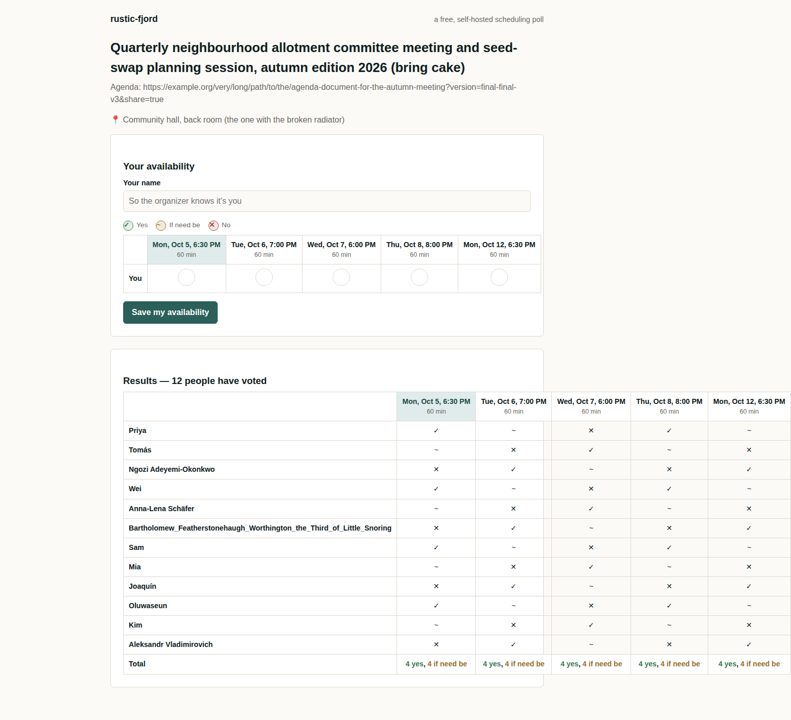
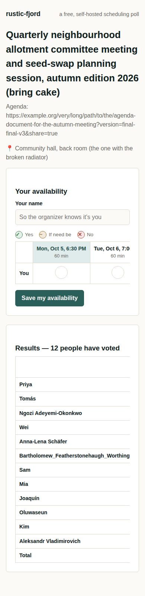

# Run 14: v1.6 check (Doodle-style group poll, Prototype mode)

| | |
|---|---|
| Date | 2026-09-25 |
| Type | Deep run: full workflow, headless, via [`../tools/run_eval.sh`](../tools/run_eval.sh), with `OSA_HOME` pointing at a throwaway projects folder, as in Run 13 |
| Skill state | v1.6 (commit `84d85d1`): `fetch_text.py`, the written design review with a template, the hand-off message, README claims checks. See the transparency note for two lines changed during the run. |
| Prompt | `Can you build me my own open-source Doodle for finding a time for group meetups? Make the calls yourself and just build it (Prototype mode).` |
| Stats | 11.3 min · 87 turns · 85 tool calls · $2.68 |
| Files | [final reply](final.md) · [trace summary](trace.md) · [full transcript](transcript.jsonl.gz) · [the project](workspace/) · [its process log](workspace/docs/process-log.md) · [its design review](workspace/docs/design/review.md) · [our browser check](review/) |

**Transparency note.** While this run was building, I edited two lines of the skill: the code-of-conduct contact must be private, and cloud sessions build in the visible working directory. The run had already loaded SKILL.md and had already written its code of conduct, so the edits couldn't have changed what it did. They're part of v1.7 below.

## Outcome in one line

**The v1.6 fixes held, apart from the screenshots.**

What held:
- LICENSE (MIT) and CODE_OF_CONDUCT.md (Contributor Covenant 3.0) are word-for-word the official texts, fetched with `fetch_text.py`.
- `docs/design/review.md` exists, with three weaknesses per screen and a claims check.
- The final reply follows the new hand-off shape.
- 17/17 tests pass, and a pristine copy starts through the launcher.

What failed: the run decided no browser was available and reviewed the interface from the source code. A real browser check found a results table that runs 270px off a desktop screen with realistic data.

## v1.6 changes: did they take?

| Change | Evidence |
|---|---|
| Legal texts fetched, never typed | ✅ `check_artifacts.py --verify-texts`: LICENSE matches MIT with 0 changed passages; CODE_OF_CONDUCT.md matches Contributor Covenant 3.0 with 0 changed passages. The process log names the source of each. |
| Written design review from the template | ⚠️ `docs/design/review.md` has three weaknesses for each of three screens, a slop-list check, a claims check and an incumbent-look check. But **no screenshots were taken**. The run wrote "no browser-automation tool available (no Playwright/Puppeteer-style tool in the toolset)", yet Playwright and Chromium were installed and Run 13 had used them. It looked for a tool in its toolset, not a library it could run. |
| Long data set and overflow check | ❌ Reasoned from CSS, not measured. The review predicted long names "should wrap rather than overflow". |
| README claims checked against the app | ✅ Every README feature was exercised with `curl` and is recorded in the log. |
| Hand-off message | ✅ It opens with "**rustic-fjord is ready**" and says the build is in the cloud session's working directory. It then gives the launcher route for the user's own machine (copy the folder into `~/Documents/open-source-anything/`, run `npx … setup`, double-click **Start projects**, press **Start**, then **Open**). After that come what works, what doesn't yet, and one question. |
| Source identity and currency | ✅ Pricing figures are labeled as aggregator figures, "indicative, not exact", with the billing basis for each. |
| Honest tags | ✅ Every fetch was blocked. The dossier says "Nothing here is tagged `confirmed`", and the process log says the research floor was "not fully met in the literal sense", and why. |

**Where it built.** The run found the projects folder (`osa where`) but built in its working directory. Its reason: the headless session ran under this cloud environment's system prompt, which says the user can only open files in the working directory. That's the right call for a cloud session, so v1.7 makes it an explicit rule rather than leaving it to judgment.

## Verification (by us, after the run)

| Check | Result |
|---|---|
| Pristine copy started by the projects folder's own launcher, run without `--home` | ✅ `Installing… Preparing… Starting… rustic-fjord is running at http://localhost:3300/` in 1.6 s. The migration ran as the launcher's `setup` step. |
| `npm test` | ✅ 17/17, including five concurrent submits producing no duplicate votes |
| Browser check with realistic and long data ([script](review/browser-check.js)) | ❌ **Desktop:** with 12 voters, one with a long unbroken name, the results table overflows its card and the screen (page 1548px wide at 1280). ✅ **Phone:** the page itself fits, because the table scrolls inside its card, but the long name pushes every vote column out of view, so you see only names. |
| README | ⚠️ No screenshot, and no launcher route (the README template wasn't opened). The manual quickstart has three commands, because migrations are a separate step instead of running on start. |
| Code of conduct contact | ⚠️ "open an issue on this repository", which is public. Harassment reports need a private channel. |

| Desktop, 12 voters, one long name | Phone, same poll |
|---|---|
|  |  |

## Design review (by us)

**Good:**
- a calm slate-teal and sand palette;
- hairline borders instead of shadows;
- plain, instructional copy;
- a clear primary action on each screen;
- a designed empty state and 404;
- a mark and a word for every vote state, so none depends on color alone.

It doesn't look like the incumbent.

**Weak:**
- the results table overflow and the hidden votes on phones (above);
- a blank band about 40px tall above each card's heading;
- options tied on votes get no marker; only the first is highlighted as "best".

## Accuracy (checked by search on 2026-09-25)

| Claim | Verdict | Evidence |
|---|---|---|
| Founded in 2007 by ETH Zürich students Michael Näf and Paul E. Sevinç; the idea came from organizing a dinner | ✅ | [Doodle's history page](https://doodle.com/en/resources/blog/the-history-of-doodle/), [Wikipedia](https://en.wikipedia.org/wiki/Doodle_(website)) |
| Incorporated as Doodle AG in 2008; more than 10 million users by 2011 | ✅ | same, plus [Tech.eu](https://tech.eu/2014/04/11/doodle/) |
| Professional ≈ $15 a month, or about $11 billed annually; Team ≈ $19.95 per user a month, or $8.95 billed annually | ✅ Matches 2026 aggregators. The dossier labeled these "indicative". | [Carly](https://www.usecarly.com/blog/doodle-pricing/), [G2](https://www.g2.com/products/doodle/pricing) |
| "Unlimited group polls are free" | ⚠️ Contested. A 2026 guide says the free tier caps active polls. Doodle's own pricing page couldn't be fetched. | [SyncWhen](https://syncwhen.com/blog/is-doodle-still-free) |
| The charter's better-thesis: Doodle "requires an account even to create a poll" | ❌ Contradicted. Doodle's help center, as quoted in search results, says polls can be created without an account. | [Doodle Help Center](https://help.doodle.com/en/articles/9457353-how-do-i-create-a-group-poll) |

**Score: 3/5 correct, 1 contested, 1 wrong.** The wrong claim sits in the charter's thesis, not the README, and it didn't change what was built: a poll with no accounts at all.

## Flaws found

1. **No screenshots.** The run treated "a browser automation tool" as a tool it must be given, not a library it could run. Its source-level review missed a real overflow and the hidden votes on phones. Every run so far has written its own capture script, so the skill should ship one.
2. **README requirements that only lived in the template were missed.** This run opened no skill references or templates at all; it worked from SKILL.md alone. So the README's run section (launcher first) and its screenshot were missed.
3. **Three manual steps instead of two.** Migrations were a separate command, despite the "starts cleanly from a fresh copy" rule.
4. **A public code-of-conduct contact.**
5. **An unchecked "unlike X, which…" claim** in the better-thesis.

## Changes made because of this run (v1.7)

- **New `scripts/capture.js`.**
  - It captures a page at desktop (1280px), phone (390px) and, when the page has one, dark mode, into `docs/design/screenshots/`.
  - It runs the overflow check at every width, names the widest offending elements, and exits with status 2 on overflow.
  - It finds Playwright (local or global), or says how to install it in a scratch folder.
  - Tested on this run's app: it reports the 1548px table on desktop and passes the home page.
- **SKILL.md Phase 7, screenshot review:**
  - load each data set, then run `capture.js`;
  - a browser library you run yourself counts as a browser tool;
  - write "no screenshots" only after the script fails, and say why.
- **SKILL.md Phase 7, README contents:**
  - "how to run it" is required inline: the launcher first, then exactly two commands;
  - the app runs its own migrations, so there's no third step.
- **SKILL.md Phase 4:** check the better-thesis limitation against the incumbent's own docs or help center.
- **The code-of-conduct contact must be private** (SKILL.md, `build-and-release.md`, and `fetch_text.py --help`).
- **Cloud sessions build in the visible working directory**, then follow the hand-off's route for getting the project onto the user's computer (SKILL.md Phase 2).
- **`ui-design.md` §6 and the review template** point to `capture.js`, run the overflow check at both widths, and give wide tables their own scroll container.
