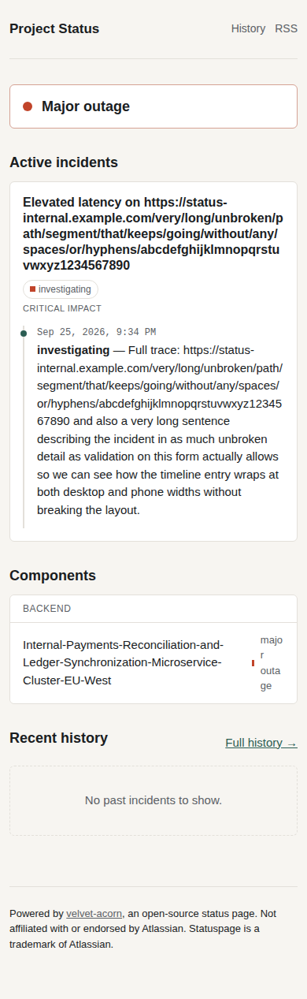

# Run 15: v1.7 check (Statuspage-style status page, Prototype mode)

| | |
|---|---|
| Date | 2026-09-25 |
| Type | Deep run: full workflow, headless, via [`../tools/run_eval.sh`](../tools/run_eval.sh), with `OSA_HOME` pointing at a throwaway projects folder. The skill wasn't edited while this run was going. |
| Skill state | v1.7 (commit `e42a68f`): the bundled `capture.js`, the launcher-first README requirement, the better-thesis check, the private code-of-conduct contact |
| Prompt | `I want my own open-source Statuspage for my side projects, so people can see what's up and read incident updates. Make the calls yourself and just build it (Prototype mode).` |
| Stats | 14.4 min · 127 turns · 125 tool calls · $4.31 |
| Files | [final reply](final.md) · [trace summary](trace.md) · [full transcript](transcript.jsonl.gz) · [the project](workspace/) · [its design review](workspace/docs/design/review.md) · [its 27 screenshots](workspace/docs/design/screenshots/) |

## Outcome in one line

**The best run so far. The bundled capture script did its job: the run captured 9 screens at desktop, phone and dark mode, with empty, many and long data, including signed-in pages. The long data set exposed two real overflows (the page grew to 2230px on desktop and 425px on a phone), and the run fixed both and re-captured to prove it.**

Legal texts were verbatim, the hand-off followed the new shape, and a pristine copy started through the launcher.

**Three problems remain:**
- The README still has no launcher route, because SKILL.md never named the README template.
- The public page's footer names the incumbent.
- The overflow fix squeezed a status label on phones.

## v1.7 changes: did they take?

| Change | Evidence |
|---|---|
| `capture.js` with data sets and the overflow check | ✅ Used 9 times, with the admin pages captured through `--cookie`. For the empty data set it started a second clean instance. The `long` capture exited with status 2 on a 1410px-wide desktop page and a 1146px-wide phone page. After the fix, the re-capture passed, and the review records the numbers before and after. |
| Browser library counts as a tool | ✅ "Playwright, found and used directly — no install needed" |
| README leads with the launcher, then two commands | ❌ The quickstart is `npm install`, `cp .env.example .env`, "edit .env: set SESSION_SECRET and ADMIN_PASSWORD to real random values", `npm start`. There's no launcher route. The run opened 9 templates, each named by path in SKILL.md, but not the README template, which SKILL.md never names. The two-command rule also clashed with "refuse to start without a secret". |
| Better-thesis claim checked | ✅ The thesis is about subscriber-based pricing and gated branding, both confirmed below. |
| Private code-of-conduct contact | ✅ No public issue tracker named. The CoC matches Contributor Covenant 3.0 apart from the filled-in contact. |
| Legal texts verbatim | ✅ MIT and Contributor Covenant 3.0, both with 0 changed passages |
| Hand-off message | ✅ It says the build is in the cloud session's working directory, gives the launcher route and the manual route, what works, what's not built yet, and one question. |
| Honest tags | ✅ Both fetches were blocked; the dossier has no `confirmed` claims and explains why. |

## Verification (by us, after the run)

| Check | Result |
|---|---|
| Pristine copy started by the projects folder's own launcher | ✅ `Installing… Starting… velvet-acorn is running at http://localhost:3001/`, showing `ADMIN_PASSWORD: 3hzx-…`, in 1.7 s |
| Sign in with the password the launcher showed | ✅ `302 → /admin`, and the admin page returns 200. A wrong password gets 401. |
| `npm test` | ✅ 10/10 |
| The run's own captures, looked at by eye | ⚠️ On a phone, a long component name squeezes its status label into a sliver ("majo / r / outa / ge"). The cause is page-wide `overflow-wrap: anywhere`, which follows our own `ui-design.md` advice too literally. The overflow check can't see this, and the written review missed it. |
| Public page footer | ❌ "Not affiliated with or endorsed by Atlassian. Statuspage is a trademark of Atlassian." This would appear on every status page a user publishes, naming another company to their visitors. |

| Public page with realistic data | Phone, long values: the squeezed status label |
|---|---|
|  |  |

## Design review (by us)

**Good:**
- a calm, readable status page;
- an overall banner computed from the worst component status;
- clear sections;
- flat hairline borders;
- monospace timestamps;
- a dark mode;
- designed empty states;
- a status timeline for each incident.

It doesn't look like the incumbent, and it isn't a card kit, since sections, lists and tables each get a structure that fits them.

**Weak:**
- the squeezed status label;
- the footer that names the incumbent;
- the "Powered by velvet-acorn" link points at `https://github.com/` as a placeholder.

## Accuracy (checked by search on 2026-09-25)

| Claim | Verdict | Evidence |
|---|---|---|
| Atlassian acquired Statuspage.io in 2016 | ✅ (14 July 2016) | [Atlassian press release](https://www.atlassian.com/company/news/press-releases/atlassian-acquires-status-and-incident-communication-platform-statuspage), [TechCrunch](https://techcrunch.com/2016/07/14/atlassian-acquires-statuspage) |
| Public pages: Free (100 subscribers, 25 components, 2 team members, 2 metrics), Hobby $29/mo, Startup $99/mo, Business $399/mo | ✅ | [Costbench](https://costbench.com/software/network-monitoring/atlassian-statuspage/), [Hyperping](https://hyperping.com/blog/statuspage-pricing) |
| Instatus: hosted, from $20/mo, and its free tier has no custom domain | ✅ (Pro is $20/mo with a custom domain) | [Hyperping on Instatus](https://hyperping.com/blog/instatus-pricing) |
| "CSS/branding and private pages locked behind the $399/mo Business tier" | ⚠️ Partly wrong. Private pages are a separate price list, starting at $79/mo. The CSS part wasn't verified. | [Costbench](https://costbench.com/software/network-monitoring/atlassian-statuspage/) |

**Score: 3/4 correct, 1 partly wrong.**

## Flaws found

1. **The README template was never named in SKILL.md.** Every template the skill names by path gets opened; this one didn't, so the README missed the launcher route.
2. **"Refuse to start without a secret" versus "two commands".** The safe-defaults rule forced a manual step of inventing secrets.
3. **The product named the incumbent.** The non-affiliation rule was applied to the product's own UI, not just the README.
4. **Our own advice was too blunt.** "Text that users write usually needs `overflow-wrap: anywhere`" became a page-wide rule, and that squeezed a flex label. The written review also judged by the overflow numbers rather than looking at each capture.
5. **A stale launcher copy** (found while verifying Run 13 again). A projects folder keeps the launcher version that `setup` copied into it. The skill ran `setup` only on its first build there, so existing folders never got fixes.

## Changes made because of this run (v1.8)

- **SKILL.md, README:** "Write the README from `assets/templates/README.md`".
- **SKILL.md, safe defaults:** if a secret is missing on first start, generate a strong one, save it, and print the sign-in details. Never use a fixed value, and never ask the user to invent one. The manual route stays at two commands, and the README template says so.
- **SKILL.md, codename rules:** the product itself never names the incumbent (pages, footer, emails, titles). The README and docs are where it and the non-affiliation line go.
- **`ui-design.md` §6:**
  - put `overflow-wrap: anywhere` only on elements that hold user text, with `min-width: 0` on their flex containers;
  - keep labels on one line;
  - a new step, "look at every capture, not just the numbers".
- **SKILL.md and the review template:** look at each capture for squeezed, broken, overlapping or clipped content.
- **SKILL.md Phase 2:** run `osa setup` on every build in the projects folder, which refreshes its launcher copy.
