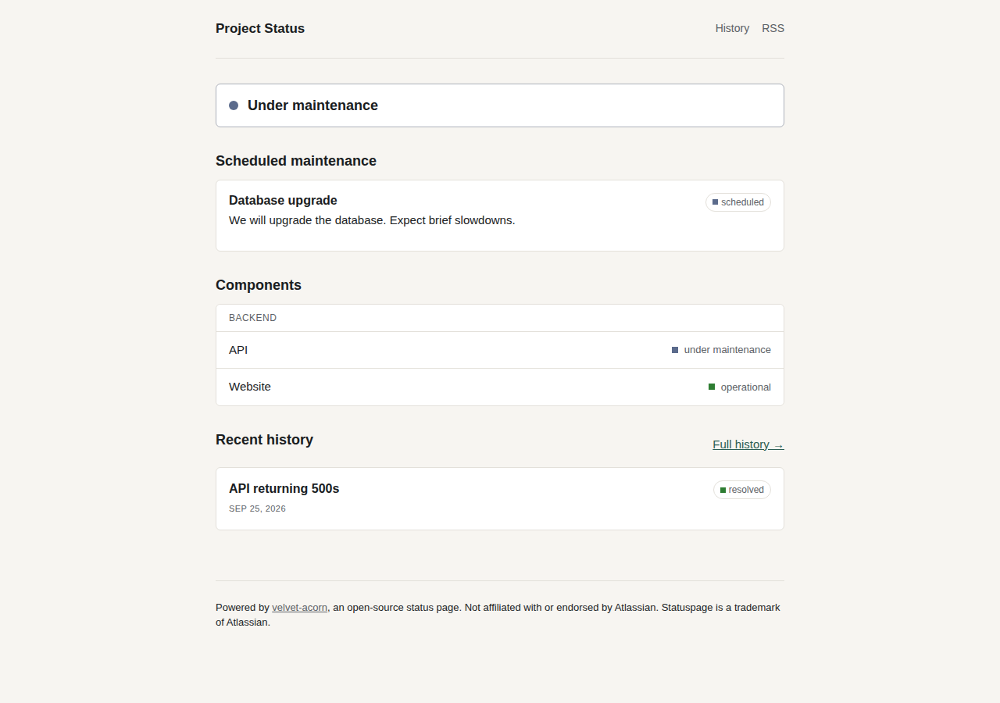

# velvet-acorn

A self-hosted status page for your side projects: components, incidents with a timestamped update timeline, scheduled maintenance, and public incident history. No subscriber limits, no CSS paywall, no external services required — it's one Node.js process and one SQLite file.



## Why

Hosted status-page tools price by subscriber count and gate custom branding and private pages behind their higher tiers — a lot for a side project used a few times a year. velvet-acorn gives you the same core loop — say something's wrong, keep people updated, show you fixed it — self-hosted, free, and yours. See `docs/brief.md` for the full reasoning and `docs/product/parity-matrix.md` for exactly what is and isn't included.

## Quickstart

```
npm install
cp .env.example .env
# edit .env: set SESSION_SECRET and ADMIN_PASSWORD to real random values
npm start
```

Open http://localhost:3000. Sign in at `/admin` with username `admin` and the password you set. The app creates its SQLite database and runs its own migrations on first start — there's no separate setup step.

Docker isn't required and isn't provided; this is a single Node process with an embedded database, which is enough for one operator's status page.

## What works

- Components: create, edit, group, reorder, and give each its own status.
- Incidents: open one, post timestamped updates as it progresses, resolve it. The public page's overall banner is always the worst current component status — computed, not typed in by hand.
- Scheduled maintenance windows, shown separately from real incidents.
- Public incident history, grouped by month.
- A read-only JSON API (`/api/status.json`) and an RSS feed (`/feed.xml`) for automation.
- Light and dark mode, and a layout that works down to phone width.

## What's not built yet

- Email/SMS/Slack subscriber notifications.
- Uptime metrics or graphs (that's a monitoring tool's job, not this one's — point an external monitor at `/api/status.json` if you want to drive status automatically).
- Multiple admin accounts or SSO — one admin account today.

See `docs/product/parity-matrix.md` for the full, honest status of every feature.

## Configuration

All configuration is environment variables — see `.env.example`. The important ones:

| Variable | What it does |
|---|---|
| `SESSION_SECRET` | Signs admin session cookies. Required; the app refuses to start without it. |
| `ADMIN_PASSWORD` | Password for the single `admin` account, hashed on first start. Required. |
| `SITE_TITLE`, `SITE_DESCRIPTION` | Shown on the public page and in the RSS feed. |
| `PORT` | What port to listen on (default 3000). |
| `COOKIE_SECURE` | Set to `true` once you're serving over HTTPS. |

## Development

```
npm run dev   # restarts on file changes
npm test      # runs the unit test suite (node --test)
```

`docs/adr/` explains the main design decisions (embedded SQLite, single-admin auth, why component status and incident status are separate state machines). `docs/design/direction.md` documents the visual design tokens.

## License

MIT — see `LICENSE`.

---

velvet-acorn is an independent, open-source project. It is not affiliated with or endorsed by Atlassian. "Statuspage" is a trademark of Atlassian, mentioned here only to describe the kind of tool this is an alternative to. See `docs/legal/provenance.md` for how this project was built.
